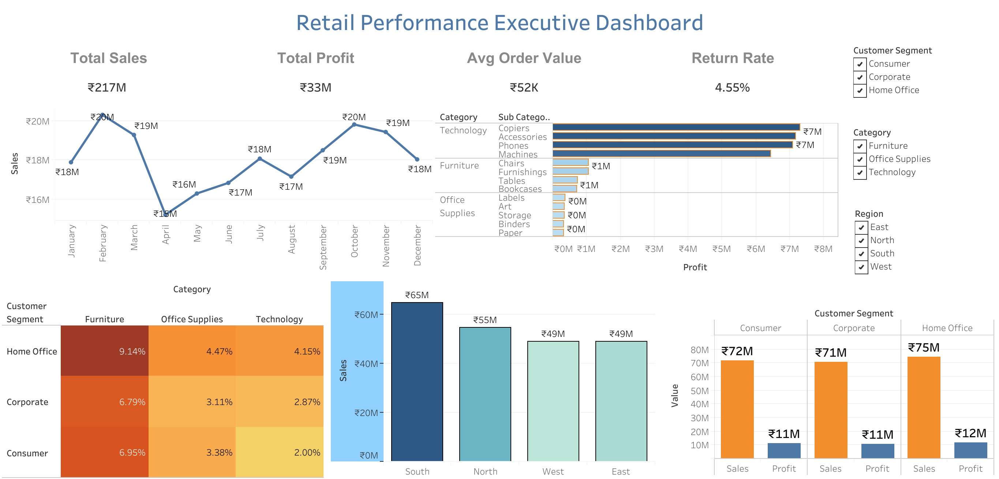

# Part 4: Tableau Executive Dashboard & Data Storytelling

# Business Problem Summary

The objective of this project is to build an interactive Tableau Executive Dashboard that helps business leaders monitor retail performance. The dashboard combines sales, profit, customer, shipping, discount, and return data into a single view to support better business decisions and identify trends, opportunities, and risks.

## Task 1: Connect and Inspect Data

### Dataset Overview

The dataset was loaded into Tableau from `dashboard_sales_data.xlsx` and inspected to verify field names, data types, and data quality before dashboard development.

### Data Fields and Types

#### Date Fields
- `order_date`
- `ship_date`

These fields were recognized as Date data types and will be used for trend analysis, seasonality assessment, and shipping performance evaluation.

#### Geographic Fields
- `region`
- `state`
- `city`

These fields enable geographic and regional performance analysis.

#### Categorical Fields
- `customer_segment`
- `category`
- `sub_category`
- `product_name`
- `ship_mode`
- `campaign_channel`

These fields are used for grouping, filtering, and comparative analysis across business dimensions.

#### Numerical Measures
- `sales`
- `profit`
- `quantity`
- `discount`
- `delivery_days`
- `customer_rating`

These fields are used for KPI calculations, profitability analysis, discount impact assessment, and operational performance monitoring.

#### Binary / Flag Fields
- `return_flag`

This field indicates whether an order was returned and is used to analyze return patterns and return rates.

### Assumptions

1. All sales and profit values are assumed to be in the same currency and comparable across the dataset.
2. The `discount` field is stored as a decimal value (e.g., 0.20 represents a 20% discount).
3. A `return_flag` value of 1 indicates a returned order, while 0 indicates a non-returned order.
4. `delivery_days` represents the number of days between order placement and shipment.
5. Records with valid dates, sales, and profit values are assumed to be complete and suitable for analysis.
6. No additional data cleaning was required beyond the inspection of field types and data consistency within Tableau.

---

## Task 2: Calculated Fields Created

The following calculated fields were created in Tableau:

- Profit Margin
- Cost
- Average Order Value
- Return Rate
- Shipping Delay Bucket
- Discount Percentage
- Profit per Order
- Sales per Customer

Detailed formulas and explanations are available in `outputs/business_insights.md`.

---

## Task 3: Create Required Tableau Sheets

Seven Tableau worksheets were created to support executive decision-making and address the business requirements provided in the scenario.

### 1. Sales Trend View
A time-series line chart showing sales performance over time. This view helps identify growth trends, seasonality, and changes in sales performance.

### 2. Regional Performance View
A bar chart comparing sales and profit across regions. This view helps identify high-performing and underperforming geographic areas.

### 3. Category Profitability View
A category and sub-category analysis showing sales and profit contribution. This view highlights the most profitable product categories and areas requiring improvement.

### 4. Customer Segment View
A comparison of sales and profit across customer segments. This view helps evaluate the contribution of Consumer, Corporate, and Home Office customers.

### 5. Shipping Performance View
An analysis of shipping modes and delivery performance using delivery days and shipping delay buckets. This view helps assess operational efficiency and customer service performance.

### 6. Discount vs Profit View
A scatter plot illustrating the relationship between discount levels and profit. This view helps identify whether higher discounts negatively impact profitability.

### 7. Return Analysis View
A return analysis showing returned orders across categories, customer segments, or regions. This view helps identify patterns that may indicate product, service, or operational issues.

These worksheets serve as the foundation for the Executive Dashboard and collectively support analysis of sales performance, profitability, customer behavior, shipping efficiency, discount impact, and return patterns.

---

# Task 4: Use Appropriate Chart Types

For this task, seven Tableau worksheets were created using chart types that best answer specific business questions. Each visualization was selected to present the data clearly, support decision-making, and avoid unnecessary visual complexity.

The following worksheets were created:

- **Sales Trend View** – A **line chart** was used to show how sales change over time and identify monthly trends.
- **Regional Performance View** – A **bar chart** was used to compare sales performance across different regions.
- **Category Profitability View** – A **horizontal bar chart** was used to compare profit across categories and sub-categories.
- **Customer Segment View** – A **grouped bar chart** was used to compare sales and profit across customer segments.
- **Shipping Performance View** – A **bar chart** was used to compare average delivery days across different shipping modes.
- **Discount vs Profit View** – A **scatter plot** was used to analyze the relationship between discount percentage and profit.
- **Return Analysis View** – A **highlight table** was used to compare return rates across customer segments and product categories, making high return-risk areas easy to identify.

Each worksheet was formatted with clear titles, appropriate labels, meaningful colours, and readable data labels to ensure consistency and improve dashboard presentation.

---

# Task 5: Build Executive Dashboard

An interactive executive dashboard was created in Tableau to provide a single-page summary of the overall retail business performance. The dashboard was designed with a clean layout, meaningful visualizations, KPI summary cards, and interactive filters to help users explore the data efficiently.

The dashboard includes the following components:

- **Dashboard Title**
  - Retail Performance Executive Dashboard

- **KPI Summary Cards**
  - Total Sales
  - Total Profit
  - Average Order Value
  - Return Rate

- **Visualizations**
  - Monthly Sales Performance Over Time (Line Chart)
  - Category Profitability View (Horizontal Bar Chart)
  - Regional Performance View (Bar Chart)
  - Customer Segment Performance Comparison (Grouped Bar Chart)
  - Return Analysis View (Highlight Table)

The **Discount vs Profit** scatter plot created in Task 4 was intentionally not included in the final dashboard to maintain a clean layout and minimize clutter. The selected visualizations provide a balanced overview of business performance while keeping the dashboard easy to read.

Three interactive filters were added to allow users to explore the dashboard dynamically:

- Region
- Category
- Customer Segment

Each filter was applied to all relevant worksheets so that selecting a value updates every visualization simultaneously.

An **Action Filter** was also configured on the **Regional Performance View**. Selecting a region in the chart automatically filters the related visualizations, allowing users to drill down into the performance of the selected region without changing the filter controls.

The dashboard was arranged using Tableau's tiled layout to create a structured and business-friendly design. KPI cards were placed at the top for quick access to key metrics, while detailed charts were positioned below to provide supporting insights.

Consistent formatting was applied throughout the dashboard, including:
- Clear and descriptive chart titles
- Appropriate font sizes and alignment
- Meaningful color choices
- Data labels for easy interpretation
- Minimal visual clutter
- Business-friendly formatting suitable for executive reporting

The completed executive dashboard satisfies the Task 5 requirements by providing:
- A clear dashboard title
- Five analytical charts/views
- Four KPI summary cards
- Three interactive filters
- One action filter interaction
- Clean layout and consistent formatting
- Clear labels and meaningful colours
- Minimal clutter with an executive-friendly presentation

## Executive Dashboard Image:

---

## Task 6: Apply Visualization Design Principles

The executive dashboard was designed using visualization best practices to improve clarity, readability, and business interpretation. Appropriate chart types were selected for each business question, and the dashboard follows a clear hierarchy with KPI cards, supporting visualizations, consistent colours, meaningful labels, readable titles, appropriate sorting, and interactive filters. An action filter was also implemented to enable interactive exploration of the dashboard.

A detailed explanation of the chart selection and visualization design principles is provided in `outputs/chart_selection_justification.md`.

---

## Task 7: Capture Required Screenshots

The required screenshots were captured after completing the Tableau worksheets and the executive dashboard. Each screenshot highlights a different business view and demonstrates the use of appropriate chart types, labels, formatting, colors, filters, and interactivity.

### `full_dashboard.png`
- Shows the complete Retail Performance Executive Dashboard.
- Includes four KPI cards: Total Sales, Total Profit, Average Order Value, and Return Rate.
- Combines five business visualizations in a clean dashboard layout.
- Uses consistent colors, readable titles, data labels, and business-friendly formatting.
- Includes interactive filters for Customer Segment, Category, and Region.
- Demonstrates an executive-level summary of the retail dataset.

### `sales_trend_view.png`
- Displays monthly sales performance using a line chart.
- Shows sales values for each month with data labels.
- Includes Region and Customer Segment filters.
- Uses a clear title, properly labeled axes, and consistent formatting to show sales trends over time.

### `regional_performance_view.png`
- Displays regional sales performance using a bar chart.
- Bars are sorted to make comparison between regions easier.
- Sales values are displayed as data labels.
- Includes Region and Customer Segment filters with consistent formatting and color usage.

### `category_profitability_view.png`
- Displays profitability by Category and Sub-Category using a horizontal bar chart.
- Groups sub-categories under their respective categories for better business interpretation.
- Profit values are shown as data labels.
- Includes Region, Customer Segment, and Action (Region) filters to support interactive analysis.

### `filter_interaction_view.png`
- Demonstrates dashboard interactivity after applying filters.
- Shows how Customer Segment, Category, and Region filters update all charts and KPI cards simultaneously.
- Demonstrates the Region action filter by displaying filtered values across the dashboard.
- Confirms successful implementation of interactive dashboard filtering and cross-sheet interactions.

---

## Task 8: Key Business Insights

- Sales peak during February and October.
- South region records the highest sales.
- Technology is the most profitable category.
- Consumer and Home Office segments contribute strong sales.
- Higher discounts generally reduce profitability.
- Furniture shows higher return rates than Technology.
- Interactive filters help compare business performance across regions, categories, and customer segments.

Detailed insights are provided in `outputs/business_insights.md`.

---

## Task 9: Dashboard Story Summary

The dashboard tells the story of overall retail business performance by combining KPI cards with trend, regional, profitability, customer segment, and return analysis. It helps leadership quickly identify strengths, risks, and opportunities while allowing deeper exploration through interactive filters and action filters.

The complete leadership narrative is available in `outputs/dashboard_story.md`.

---

## Task 10: Chart Selection Justification

Each major chart in the dashboard was selected based on the business question it answers. The justification explains why a particular chart type was chosen, the fields used for labels, colours, filters, and measures, the visualization design principles applied, and the common visualization mistakes that were avoided.

A detailed chart-by-chart explanation is provided in `outputs/chart_selection_justification.md`.

---

## Assumptions and Limitations

### Assumptions

- The dataset is complete and accurately represents retail sales transactions.
- All sales and profit values are recorded in the same currency.
- Return Rate and Average Order Value are calculated using the provided data without external adjustments.
- The calculated fields are assumed to correctly represent the intended business metrics.
- Dashboard insights are based only on the available historical data.

### Limitations

- The dashboard is limited to the provided dataset and does not include external business or market factors.
- The analysis does not perform forecasting or predictive modeling.
- Results depend on the quality and completeness of the source data.
- The dashboard is designed for executive-level monitoring and may require additional detailed analysis for operational decision-making.

---